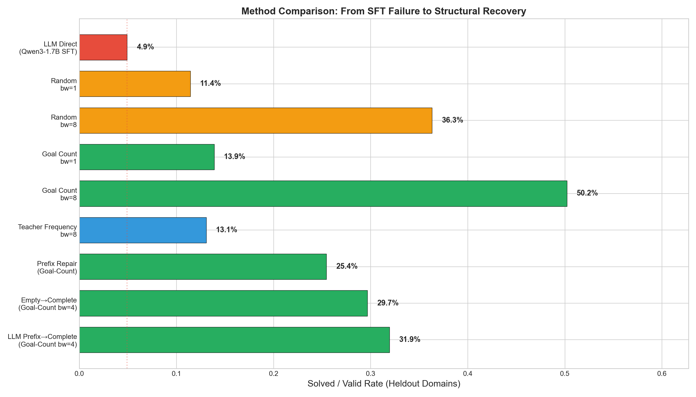

# TARS — Verifier-Grounded LLM Planning

**CSE-574, Arizona State University**
Team: Rhythm Arya, Mohak Rathod, Abhiram Menon

> Small-LLM SFT collapses as an autonomous PDDL planner (0% VAL-valid on non-trivial instances), but verifier-grounded structure recovers useful planning behavior through failure diagnostics, legality-constrained search, prefix-salvage repair, and mode selection.



---

## Motivation

We fine-tuned Qwen3-1.7B on teacher-generated PDDL plans across 8 training domains (3 representations: standard, anonymized, compact). Training loss decreased normally, but **VAL-verified plan validity remained at 0%** for all non-trivial instances. Only 3-step miconic elevator problems were solved (13.4% of miconic).

Rather than abandoning the project, we pivoted to ask: *what structure can a verifier extract from these failures?*

## Key Results

| Method | Heldout Solved Rate |
|---|---|
| LLM Direct (Qwen3-1.7B SFT) | 4.9% |
| Random legal actions, beam=8 | 36.3% |
| **Goal-count ranker, beam=8** | **50.2%** |
| Prefix repair (goal-count) | 25.4% |
| LLM prefix + completion | 31.9% |

### Diagnostic Findings
- **Schema-valid action fraction ~100%**: the model knows the right action names
- **46% of plans fail at step 0**: first action is inapplicable
- **Transport**: 95% of plans have a nonzero executable prefix (model gets the opening right)
- **Sokoban**: degenerate 157-action loops
- Compact representation produces parseable actions; standard/anonymized also parse but still fail semantically

### Constrained Search
Beam search over SAS-legal actions with a goal-count heuristic solves **50.2% of heldout instances** — a 10x improvement over the LLM. Even random legal actions solve 36.3%, proving that **legality constraint is the primary driver**, not ranking quality.

### Repair Ablation
The LLM's executable prefix provides only marginal benefit over starting from scratch (31.9% vs 29.7%). Random legal prefixes perform equivalently (30.8%). The LLM makes legal but strategically arbitrary moves.

### Portfolio Selector
A random forest selector achieves **54.0% mode-selection accuracy** (leave-one-domain-out CV) vs 21.8% most-frequent baseline, demonstrating that cheap structural features predict which planning mode works per instance.

---

## Repository Structure

```
src/
  planning_pivot/           # Verifier-grounded evaluation framework
    sas.py                  # SAS parser and simulator (core)
    constrained_search.py   # Beam search over legal actions
    repair.py               # Prefix-salvage plan repair
    diagnostics.py          # VAL-grounded failure classification
    rankers.py              # Action rankers (random, goal_count, teacher_freq, hf_logprob)
    portfolio.py            # Mode selection classifier
    val.py                  # VAL validation wrapper
    fd.py                   # Fast Downward wrapper
    plan_io.py              # Plan parsing and normalization
    cli.py                  # Typer CLI
    config.py               # Pydantic config
    paths.py                # Tool discovery
    shell.py                # Subprocess wrapper
    features.py             # Instance feature extraction
    reporting.py            # Figures and tables
  generation/               # Instance generation, FD solving, VAL validation
  pddl_ops/                 # Anonymization, compact serialization
  training/                 # SFT training (failed direction, kept for reference)
  inference/                # LLM plan generation
configs/
  pivot_local.yaml          # Local experiment config
  pivot_sol.yaml            # SOL cluster config
  splits/phase1_v1.yaml     # Domain splits
scripts/                    # Pipeline scripts (00-08)
results/                    # All experiment artifacts
```

## Running the Pipeline

```bash
pip install -r requirements-pivot.txt

python -m planning_pivot.cli audit
python -m planning_pivot.cli build-index
python -m planning_pivot.cli cache-sas
python -m planning_pivot.cli diagnose
python -m planning_pivot.cli constrained-search
python -m planning_pivot.cli repair
python -m planning_pivot.cli portfolio
python -m planning_pivot.cli report
```

## Domains

**Train (8):** blocksworld, gripper, ferry, delivery, childsnack, floortile, rovers, spanner

**Heldout (4):** miconic, sokoban, transport, satellite

## Third-Party Dependencies

| Submodule | Role |
|---|---|
| `third_party/downward` | Fast Downward (SAS translation + teacher planning) |
| `third_party/VAL` | Plan validation (final correctness authority) |
| `third_party/pddl-generators` | Instance generation |
| `third_party/LLaMAFactory` | SFT training |
